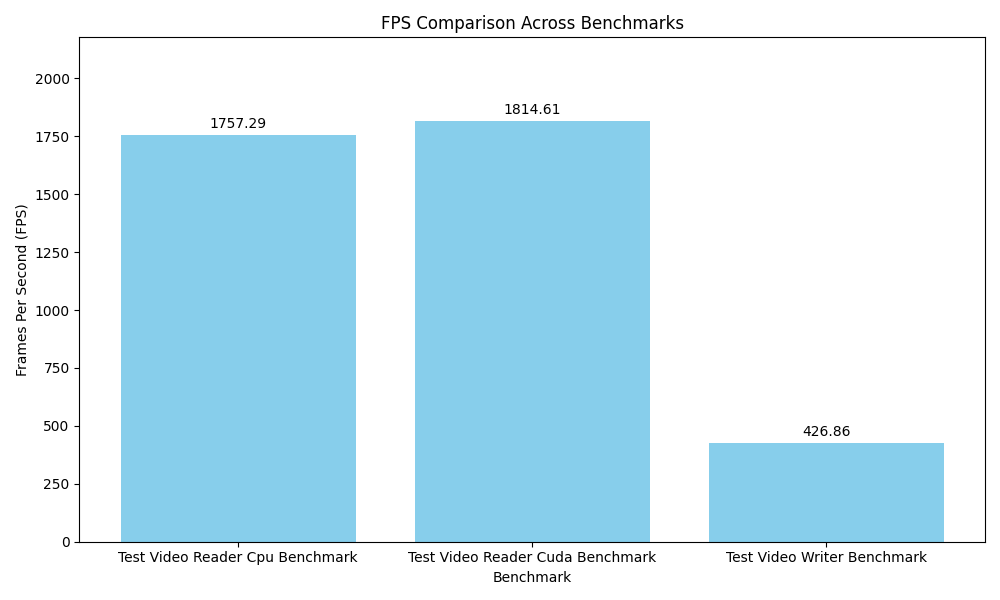
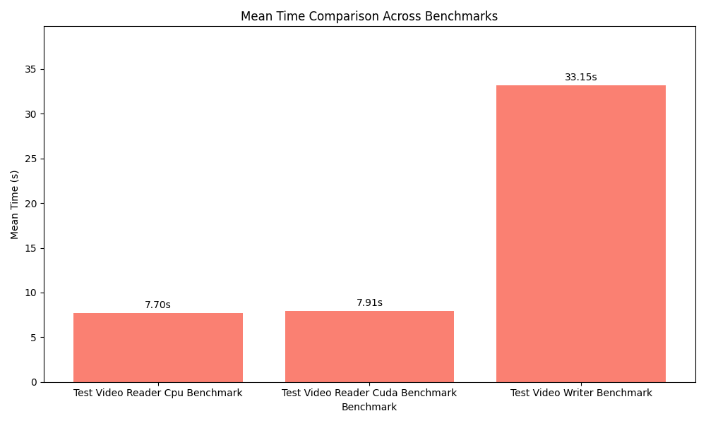

[](LICENSE)
[](https://pypi.org/project/celux/)
[](https://pypi.org/project/celux-cuda/)
[](https://pypi.org/project/celux/)
[](https://pypi.org/project/celux/)
[](https://discord.gg/hFSHjGyp4p)


# CeLux

**CeLux** is a high-performance Python library for video processing, leveraging the power of FFmpeg. It delivers some of the fastest decode times for full HD videos globally, enabling efficient and seamless video decoding directly into PyTorch tensors.

The name **CeLux** is derived from the Latin words `celer` (speed) and `lux` (light), reflecting its commitment to speed and efficiency.


## 🚀 Features

- **⚡ Ultra-Fast Video Decoding:** Achieve lightning-fast decode times for full HD videos using hardware acceleration.
- **🔗 Direct Decoding to Tensors:** Decode video frames directly into PyTorch tensors for immediate processing.
- **🖥️ Hardware Acceleration Support:** Utilize CUDA for GPU-accelerated decoding, significantly improving performance.
- **🔄 Easy Integration:** Seamlessly integrates with existing Python workflows, making it easy to incorporate into your projects.
- **🗂️ Supports Multiple Data Types:** Handle video frames in `uint8`, `float32`, or `float16` data types.

## 📦 Installation

**CeLux** offers two installation options tailored to your system's capabilities:

1. **CPU-Only Version:** For systems without CUDA-capable GPUs.
2. **CUDA (GPU) Version:** For systems with NVIDIA GPUs supporting CUDA.

### 🖥️ CPU-Only Installation

Install the CPU version of **CeLux** using `pip`:

```bash
pip install celux
```

**Note:** The CPU version **only** supports CPU operations. Attempting to use GPU features with this version will result in an error.

### 🖥️ CUDA (GPU) Installation

Install the CUDA version of **CeLux** using `pip`:

```bash
pip install celux-cuda
```

**Note:** The CUDA version **requires** a CUDA-capable GPU and the corresponding Torch-Cuda installation.

### 🔄 Both Packages Import as `celux`

Regardless of the installation choice, both packages are imported using the same module name:

```python
import celux #as cx
```

This design ensures a seamless transition between CPU and CUDA versions without changing your import statements.

## 📚 Getting Started

### 🎉 Quick Start

Here's a simple example demonstrating how to use **CeLux** to read video frames and process them:

```python
import celux as cx

def process_frame(frame):
    # Implement your frame processing logic here
    pass

# Choose device based on your installation
device = "cuda" if torch.cuda.is_available() else "cpu"

with cx.VideoReader(
    "path/to/input/video.mp4",
    device=device,      # "cpu" or "cuda"
    d_type="uint8"       # Options: "uint8", "float32", "float16"
) as reader:
    for frame in reader:
        # Frame is a PyTorch tensor in HWC format
        process_frame(frame)
```

**Parameters:**

- `device` (str): Device to use. Can be `"cpu"` or `"cuda"`.
- `d_type` (str): Data type of the output frames (`"uint8"`, `"float32"`, or `"float16"`).

**Note:** If you set `d_type` to `"float"` or `"half"`, the frame values will be normalized between `0.0` and `1.0`.

### 📜 Detailed Usage

**CeLux** allows you to efficiently decode and process video frames with ease. Below are some common operations:

#### Initialize VideoReader

```python
reader = cx.VideoReader(
    "path/to/video.mp4",
    device="cuda",        # Use "cpu" or "cuda"
    d_type="float32",      # Data type: "uint8", "float32", "float16"
)
```

#### Iterate Through Frames

```python
for frame in reader:
    # Your processing logic
    pass
```

#### Access Video Properties

```python
properties = reader.get_properties()
print(properties)
```

## 🛠️ Building from Source

While **CeLux** is easily installable via `pip`, you might want to build it from source for customization or contributing purposes.

1. **Clone the Repository:**

    ```bash
    git clone https://github.com/Trentonom0r3/celux.git
    cd celux
    ```

2. **Install Dependencies:**

    Ensure all prerequisites are installed. You can use `vcpkg` for managing dependencies on Windows.

3. **Configure the Project with CMake:**

    ```bash
    cmake -B build -S . -DCMAKE_BUILD_TYPE=Release
    ```

    **Windows Users:** If using Vcpkg, include the toolchain file:

    ```bash
    cmake -B build -S . -DCMAKE_BUILD_TYPE=Release -DCMAKE_TOOLCHAIN_FILE=<path_to_vcpkg>/scripts/buildsystems/vcpkg.cmake
    ```

4. **Build the Project:**

    ```bash
    cmake --build build --config Release
    ```

5. **Install the Package:**

    ```bash
    cmake --install build
    ```

6. **Set Up Environment Variables:**

    Ensure FFmpeg binaries and other dependencies are in your system's `PATH`. On Unix systems, you might need to set `LD_LIBRARY_PATH` or `DYLD_LIBRARY_PATH`.

## 🤝 Contributing

We welcome contributions! Follow these steps to contribute:

1. **Fork the Repository:**

    Click the "Fork" button at the top right of the repository page.

2. **Clone Your Fork:**

    ```bash
    git clone https://github.com/your-username/celux.git
    cd celux
    ```

3. **Create a New Branch:**

    ```bash
    git checkout -b feature/your-feature-name
    ```

4. **Make Your Changes:**

    Implement your feature or bugfix.

5. **Commit Your Changes:**

    ```bash
    git commit -am "Add your commit message here"
    ```

6. **Push to Your Fork:**

    ```bash
    git push origin feature/your-feature-name
    ```

7. **Submit a Pull Request:**

    Go to the original repository and click on "Pull Requests," then "New Pull Request."

## 📈 Changelog

### Version 0.3.9 (2024-10-21)
 
- **Pre-Release Update:**
  - Prep for **0.4.0** release.
    - **0.4.x** release will be characterized by new codec and pixel format support!
    - Removed `d_type` and `buffer_size` arguments from `VideoReader` and `VideoWriter`.
      - Output and Input tensors are now, by standard, `UINT8`, `HWC` format.
    - Standardized to `YUV420P` for now.
    - Swapped custom `CUDA` kernels for `nppi`. 
    - various cleanup and small refactorings.

### Version 0.3.8 (2024-10-21)
 
- **Pre-Release Update:**
  - Removed Buffering from `VideoWriter`, resulting in **INSANE** performance gains.
  - Fixed threading issue with `VideoWriter`, now properly utilizes available threads.
  - Removed `sync` method from `VideoWriter`. 
    - Synchronization can be manually handled by the user or by letting the `VideoWriter` do so on destruction. 
  - Updated Benchmarks to reflect new version.

### Version 0.3.7 (2024-10-21)

- **Pre-Release Update:**
  - Fixed remaining issues with `VideoWriter` class.
    - Both `cpu` and `cuda` arguments NOW work properly.
  - Few Small bug fixes regarding synchronization and memory management. 

### Version 0.3.6 (2024-10-19)

- **Pre-Release Update:**
  - Fixed `VideoWriter` class.
    - Both `cpu` and `cuda` arguments now work properly.
  - **Encoder Functionality:**
    - Enabled encoder support for both CPU and CUDA backends.
    - Users can now encode videos directly from PyTorch tensors.
  - Update Github Actions, add tests.

### Version 0.3.5 (2024-10-19)

- **Pre-Release Update:**
  - (somewhat) Fixed `VideoWriter` class. Working on `cuda` for now, but `cpu` still has incorrect output.
  - Added `VideoWriter`, and `LogLevel` definitions to `.pyi` stub file.
  - Adjusted github actions to publish to `pypi`.

### Version 0.3.4.1 (2024-10-19)

- **Pre-Release Update:**
  - Added logging utility for debugging purposes.
    ```py
    import celux
    celux.set_log_level(celux.LogLevel.debug)
    ```

### Version 0.3.3 (2024-10-19)

- **Pre-Release Update:**
  - Added `buffer_size` and `stream` arguments.
    - Choose Pre-Decoded Frame buffer size, and pass your own cuda stream.
  - Some random cleanup and small refactorings.

### Version 0.3.1 (2024-10-17)

- **Pre-Release Update:**
  - Adjusted Frame Range End in `VideoReader` to be exclusive to match `cv2` behavior.
  - Removed unnecessary error throws.
  - **Encoder Functionality:** Now fully operational for both CPU and CUDA.

### Version 0.3.0 (2024-10-17)

- **Pre-Release Update:**
  - Renamed from `ffmpy` to `CeLux`.
  - Created official `pypi` release.
  - Refactored to split `cpu` and `cuda` backends.

  
### Version 0.2.6 (2024-10-15)

- **Pre-Release Update:**
  - Removed `Numpy` support in favor of `PyTorch` tensors with GPU/CPU support.
  - Added `NV12ToBGR`, `BGRToNV12`, and `NV12ToNV12` conversion modules.
  - Fixed several minor issues.
  - Updated documentation and examples.

### Version 0.2.2 (2024-10-14)

- **Pre-Release Update:**
  - Fixed several minor issues.
  - Made `VideoReader` and `VideoWriter` callable.
  - Created BGR conversion modules.
  - Added frame range (in/out) arguments.

    ```python
    with VideoReader('input.mp4')([10, 20]) as reader:
        for frame in reader:
            print(f"Processing frame {frame}")
    ```

### Version 0.2.1 (2024-10-13)

- **Pre-Release Update:**
  - Adjusted Python bindings to use snake_case.
  - Added `.pyi` stub files to `.whl`.
  - Adjusted `dtype` arguments to (`uint8`, `float32`, `float16`).
  - Added GitHub Actions for new releases.
  - Added HW Accel Encoder support, direct encoding from numpy/tensors.
  - Added `has_audio` property to `VideoReader.get_properties()`.

### Version 0.1.1 (2024-10-06)

- **Pre-Release Update:**
  - Implemented support for multiple data types (`uint8`, `float`, `half`).
  - Provided example usage and basic documentation.

## 📄 License

This project is licensed under the **GNU Affero General Public License v3.0 (AGPL-3.0)**. See the [LICENSE](LICENSE) file for details.

## 🙏 Acknowledgments

- **[FFmpeg](https://ffmpeg.org/):** The backbone of video processing in CeLux.
- **[PyTorch](https://pytorch.org/):** For tensor operations and CUDA support.
- **[Vcpkg](https://github.com/microsoft/vcpkg):** Simplifies cross-platform dependency management.
- **[@NevermindNilas](https://github.com/NevermindNilas):** For assistance with testing, API suggestions, and more.

# 📈 **Benchmarks**
<!-- BENCHMARKS_START -->

### 🖥️ **System Specifications**

| Specification         | Details                                 |
|-----------------------|-----------------------------------------|
| **Processor**         | Intel64 Family 6 Model 154 Stepping 3, GenuineIntel |
| **Architecture**      | AMD64 |
| **Python Version**    | 3.12.7 (CPython) |
| **Python Build**      | tags/v3.12.7:0b05ead Oct  1 2024 03:06:41 |
| **Operating System**  | Windows 11 |
| **CPU Brand**         | 12th Gen Intel(R) Core(TM) i7-12700H |
| **CPU Frequency**     | 2.3000 GHz |
| **L2 Cache Size**     | 11776 KB |
| **L3 Cache Size**     | 24576 KB |
| **Number of Cores**   | 20 |
| **GPU #1**           | NVIDIA GeForce RTX 3060 Laptop GPU (6.00 GB) |


| Benchmark                      | Mean Time (s) | Std Dev (s) | FPS    |
|--------------------------------|---------------|------------|--------|
| Test Video Reader Cpu Benchmark | 8.15          | 0.15       | 1757.29 |
| Test Video Reader Cuda Benchmark | 7.89          | 0.02       | 1814.61 |
| Test Video Writer Benchmark | 33.54          | 0.41       | 426.86 |


### 📊 **Benchmark Visualizations**






<!-- BENCHMARKS_END -->

## ❓ FAQ

### Q: Can I use **CeLux** without CUDA or GPU acceleration?

**A:** Yes, you can set `device="cpu"` when initializing `VideoReader`. However, decoding performance will be significantly slower compared to GPU-accelerated decoding.

### Q: What video formats are supported?

**A:** **CeLux** aims to support all video formats and codecs supported by FFmpeg. However, hardware-accelerated decoding is currently available for specific codecs like H.264 and HEVC. These are the only codecs tested so far.

### Q: How do I report a bug or request a feature?

**A:** Please open an issue on the [GitHub Issues](https://github.com/Trentonom0r3/celux/issues) page with detailed information about the bug or feature request.

## 🚤 Roadmap

- **Support for Additional Codecs:**
  - Expand the range of supported video codecs.
  
- **Audio Processing:**
  - Introduce capabilities for audio extraction and processing.

- **Performance Enhancements:**
  - Further optimize decoding performance and memory usage.

- **Cross-Platform Support:**
  - Improve compatibility with different operating systems and hardware configurations.

